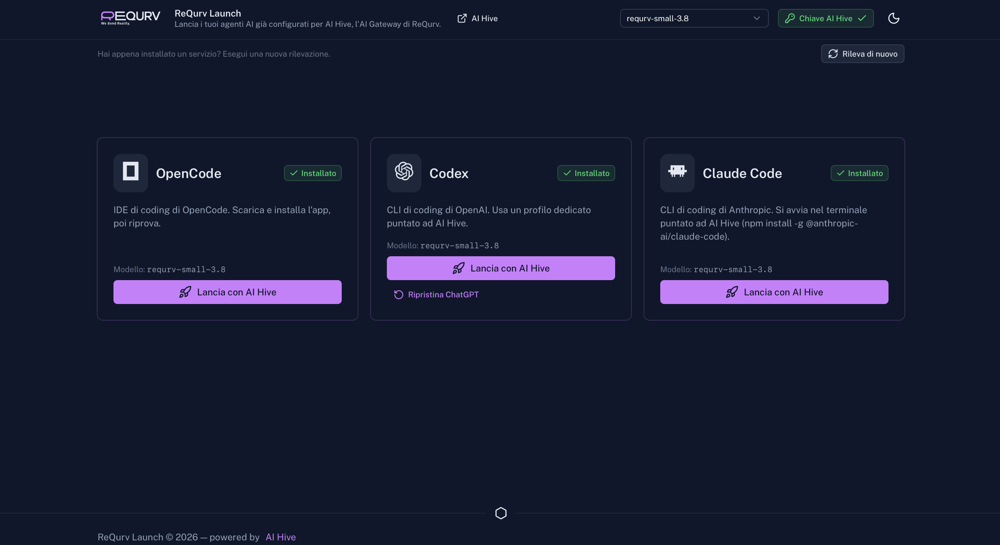

# ReQurv Launch

[](./LICENSE)
[](https://github.com/ReQurv/requrv-launch/actions)
[](https://github.com/ReQurv/requrv-launch/releases)
[](https://github.com/ReQurv/requrv-launch/releases)


ReQurv Launch is a desktop application that launches your AI coding agents pre-configured for [AI Hive](https://hive.requrv.ai), the ReQurv AI gateway.

[-dmg-00DC82?logo=apple&logoColor=white)](https://github.com/ReQurv/requrv-launch/releases/latest/download/ReQurv.Launch_aarch64.dmg)
[](https://github.com/ReQurv/requrv-launch/releases/latest/download/ReQurv.Launch_x64-setup.exe)
[](https://github.com/ReQurv/requrv-launch/releases/latest/download/ReQurv.Launch_amd64.AppImage)



## Supported agents

- [OpenCode](https://opencode.ai) — coding IDE (on macOS both the desktop app and the CLI are supported, elsewhere the CLI)
- [Codex](https://chatgpt.com/codex) — OpenAI's coding CLI (on macOS the ChatGPT app is also supported)
- [Claude Code](https://claude.com/product/claude-code) — Anthropic's coding agent (CLI)

## Features

- Save and verify your AI Hive API key (validated against the gateway when saved)
- List the models available on AI Hive and pick a default one
- Automatic detection of installed agents (with support for nvm, Volta, Homebrew, global npm installs and stale Windows registry PATH entries)
- One-click launch:
  - **Destination choice**: when both the desktop app and the CLI are installed, a dialog asks whether to open the app or the terminal; otherwise the launch goes directly to the available target
  - **OpenCode**: writes the `requrv-hive` provider into the global config file (`~/.config/opencode/opencode.jsonc` or `.json`), preserving other settings and creating a backup
  - **Codex (terminal)**: creates a dedicated profile (`~/.codex/hive.config.toml`) with `wire_api = "responses"` and launches the CLI with `--profile hive` and the `HIVE_API_KEY` variable
  - **ChatGPT.app (app, macOS only)**: points `~/.codex/config.toml` at AI Hive through a dedicated `requrv-hive` provider (`base_url`, `wire_api = "responses"`, key included; no WebSocket, which the gateway does not support) plus a model catalog in `~/.codex/hive-models.json`, and saves the key in `~/.codex/auth.json` in apikey mode; the original files are backed up as `.hive.bak` and can be restored with one click from the "Restore ChatGPT" button. The model catalog is read at startup, so if the app is already open a restart is requested
  - **Claude Code (terminal)**: launches the CLI pointed at AI Hive using environment variables only (`ANTHROPIC_BASE_URL`, `ANTHROPIC_API_KEY`, `ANTHROPIC_MODEL`), without touching `~/.claude`; first verifies that the gateway exposes the `/messages` endpoint (Anthropic Messages API). (The Code tab of Claude Desktop is not supported: in consumer versions it is bound to the claude.ai account and cannot use an external gateway)

On macOS the agents are TUI applications: the launch opens a script in the system terminal, providing a real TTY.

## Installation

Download the latest build for your platform from the [Releases page](https://github.com/ReQurv/requrv-launch/releases):

| Platform | Packages                              |
| -------- | ------------------------------------- |
| macOS    | `.dmg` (and `.app.tar.gz`)            |
| Linux    | `.AppImage` and `.deb`                |
| Windows  | `.msi` (and NSIS `.exe` installer)    |

You need an AI Hive API key, which you paste into the app once (it is validated against the gateway and stored locally).

### Code signing

- **macOS**: release builds are code-signed (Developer ID) and notarized, so the app opens without any Gatekeeper warning
- **Windows**: the build is not code-signed. When SmartScreen shows "Windows protected your PC", click **More info** → **Run anyway**
- **Linux**: unsigned packages. If the AppImage won't start, grant it execute permission with `chmod +x ReQurv-Launch_*.AppImage`

## Development

Requirements:

- [Bun](https://bun.sh)
- [Rust](https://rustup.rs) (for the Tauri backend)
- Tauri system dependencies: see the [prerequisites](https://tauri.app/start/prerequisites/)

Install the dependencies:

```bash
bun install
```

Start the app in development mode (Nuxt on `http://localhost:3001` + Tauri window):

```bash
bun run tauri dev
```

To develop the web part only (without Tauri; Tauri-bound features degrade automatically):

```bash
bun run dev
```

### Scripts

| Script              | Description                                       |
| ------------------- | ------------------------------------------------- |
| `bun run dev`       | Nuxt dev server (web only)                        |
| `bun run build`     | Production frontend build (SSG)                   |
| `bun run preview`   | Local preview of the production build             |
| `bun run tauri`     | Tauri CLI (`dev`, `build`, etc.)                  |
| `bun run build:mac` | Signed + notarized macOS release build (reads Apple credentials from the gitignored `.env`) |
| `bun run lint`      | ESLint                                            |
| `bun run typecheck` | Typecheck with `nuxt typecheck` / `vue-tsc`       |

Rust tests:

```bash
cd src-tauri
cargo test
```

## Project structure

```
app/                  # Nuxt frontend (UI, useHive composable)
src-tauri/            # Tauri backend (commands, service detection, launch)
public/               # Static assets (logo, favicon)
docs/                 # Documentation assets
```

Tauri commands exposed to the frontend (`src-tauri/src/commands.rs`):

- `get_hive_key` / `set_hive_key` / `delete_hive_key` — key management (stored in `hive.json` in the app config folder, with a `.bak` backup)
- `list_hive_models` — lists models from the gateway `GET /models`
- `check_services` — detects installed agents (and whether ChatGPT.app is configured for Hive)
- `launch_service` — configures and launches the selected service
- `configure_chatgpt_app` / `open_chatgpt_app` / `restart_chatgpt_app` / `restore_chatgpt_app` — configure, open, restart and restore ChatGPT.app on AI Hive

## Releases

Local build of the binaries and bundles:

```bash
bun run tauri build
```

Releases are automated: CI (`.github/workflows/build.yml`) builds for macOS, Linux and Windows and publishes a GitHub Release whenever a `v*` tag is pushed. The macOS bundle is code-signed (Developer ID) and notarized using repository secrets.

## CI

CI (`.github/workflows/ci.yml`) runs lint, typecheck and the Rust tests on every push.

## Contributing

Contributions are welcome — especially new agent connectors. See [CONTRIBUTING.md](./CONTRIBUTING.md) for development setup, code conventions and a step-by-step guide for adding a new connector.

- [Code of Conduct](./CODE_OF_CONDUCT.md)
- [Security policy](./SECURITY.md)

## License

[GPL-3.0-or-later](./LICENSE) © 2025-2026 ReQurv
